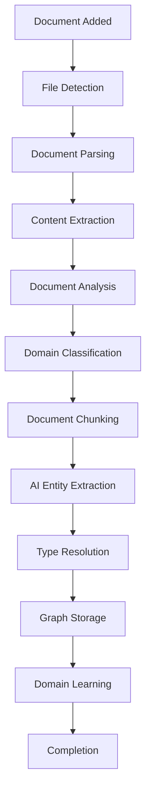

# Workflow Documentation

## Overview

This document describes the complete end-to-end workflows in the AKG system, from document ingestion to graph querying.

## Primary Workflows

### 1. Document Processing Workflow

**Trigger**: New document added to input directory or manual processing



#### Step-by-Step Process

**1. File Detection**
```python
# Triggered by LocalFileIngestionAgent
async def scan_for_documents(self, directory: Path) -> List[Path]:
    """
    Scan directory for new or modified documents.
    
    Process:
    - Calculate file hashes for change detection
    - Filter by supported file types
    - Skip already processed files
    - Return list of files to process
    """
```

**2. Document Parsing**
```python
# DocumentParser selects appropriate parser
async def parse_document(self, file_path: Path) -> Optional[Document]:
    """
    Parse file into Document object.
    
    Supported formats:
    - PDF: Using LlamaParse for complex layouts
    - DOCX: python-docx for Word documents
    - TXT/MD: Direct text extraction
    - HTML: BeautifulSoup for web content
    - XLSX: Pandas for spreadsheet data
    """
```

**3. Document Analysis**
```python
# EntityExtractionAgent analyzes document nature
async def _analyze_document_nature(self, document: Document) -> Dict:
    """
    Classify document domain and characteristics.
    
    Analysis includes:
    - Domain classification (technical, business, legal)
    - Content type (specification, meeting notes, contract)
    - Structural elements (lists, tables, procedures)
    - Processing hints for optimal extraction
    """
```

**4. Document Chunking**
```python
def _chunk_document(self, document: Document) -> List[str]:
    """
    Split document for optimal AI processing.
    
    Strategy:
    - Target chunk size: 2000 characters
    - Overlap: 200 characters for context
    - Split at sentence boundaries
    - Preserve paragraph structure
    """
```

**5. AI Entity Extraction**
```python
async def _process_chunk_with_gemini(self, chunk: str, context: Dict) -> Tuple[List[Entity], List[Relationship]]:
    """
    Extract entities and relationships using Google Gemini.
    
    Process:
    - Create adaptive prompt based on document analysis
    - Include existing type context for consistency
    - Parse structured JSON response
    - Validate extracted data
    """
```

**6. Type Resolution**
```python
async def _parse_gemini_response_with_type_resolution(self, response: str, document_id: str) -> Tuple[List[Entity], List[Relationship]]:
    """
    Resolve and normalize extracted types.
    
    Features:
    - Fuzzy matching against existing types
    - Type standardization (PERSON, API, etc.)
    - Relationship type normalization (ALL CAPS)
    - Confidence scoring
    """
```

**7. Graph Storage**
```python
async def save_to_neo4j(self, entities: List[Entity], relationships: List[Relationship]) -> bool:
    """
    Save to Neo4j with dynamic labeling.
    
    Features:
    - Create entities with :Entity:TYPE labels
    - Standardize relationship types
    - Handle duplicates and merging
    - Update type caches
    """
```

**8. Domain Learning**
```python
async def store_domain_types(self, entities: List[Entity], relationships: List[Relationship], domain: str):
    """
    Learn and cache domain-specific types.
    
    Storage:
    - Entity types by domain in Supabase
    - Relationship patterns with source verbs
    - Usage statistics and confidence scores
    - Analysis cache for similar documents
    """
```

### 2. Real-time Processing Workflow

**Trigger**: File system changes (when `WATCH_DIRECTORY=true`)

```python
class DirectoryWatcher:
    """Monitors document directory for changes."""
    
    async def on_file_added(self, file_path: Path):
        """Handle new file addition."""
        logger.info(f"📄 New file detected: {file_path}")
        await self.process_single_document(file_path)
    
    async def on_file_modified(self, file_path: Path):
        """Handle file modification."""
        # Check if content actually changed via hash
        if await self.has_content_changed(file_path):
            logger.info(f"📝 File modified: {file_path}")
            await self.process_single_document(file_path)
```

### 3. Batch Processing Workflow

**Trigger**: Manual execution of `python run.py`

```python
async def process_all_documents(self) -> ProcessingStats:
    """
    Process all documents in input directory.
    
    Features:
    - Parallel processing (configurable concurrency)
    - Progress tracking with Rich UI
    - Error handling and retry logic
    - Performance metrics collection
    """
    
    semaphore = asyncio.Semaphore(config.max_concurrent_documents)
    
    async def process_single(doc_path: Path) -> ExtractionResult:
        async with semaphore:
            return await self.ingestion_agent.process_document(doc_path)
    
    # Process with progress tracking
    with Progress() as progress:
        task = progress.add_task("Processing documents...", total=len(document_paths))
        
        tasks = [process_single(path) for path in document_paths]
        results = await asyncio.gather(*tasks, return_exceptions=True)
        
    return ProcessingStats(results)
```

### 4. Fallback Processing Workflow

**Trigger**: AI service failure or unavailable

```python
async def extract_with_fallback(self, document: Document) -> Tuple[List[Entity], List[Relationship]]:
    """
    Extract entities with AI service fallback.
    
    Fallback chain:
    1. Google Gemini AI (primary)
    2. Cached domain types (secondary)
    3. Pattern-based extraction (tertiary)
    4. Graceful degradation (final)
    """
    
    try:
        # Primary: AI extraction
        return await self._extract_with_gemini(document)
    except AIServiceUnavailable:
        logger.warning("🔄 AI service unavailable, using domain fallback")
        return await self._extract_with_domain_types(document)
    except Exception as e:
        logger.error(f"🔄 AI extraction failed, using pattern fallback: {e}")
        return await self.fallback_extractor.extract(document)
```

## Query Workflows

### 1. Entity Discovery Workflow

```python
# Find entities by type using dynamic labels
async def find_entities_by_type(self, entity_type: str) -> List[Entity]:
    """
    Discover entities of specific type.
    
    Query strategy:
    1. Use dynamic label if available (:PERSON)
    2. Fall back to property filter (type = "PERSON")
    3. Include confidence scoring
    4. Return sorted by relevance
    """
    
    sanitized_type = self._sanitize_label(entity_type)
    
    # Try dynamic label first (faster)
    query = f"""
    MATCH (e:Entity:{sanitized_type})
    RETURN e
    ORDER BY e.confidence_score DESC, e.name ASC
    LIMIT 100
    """
```

### 2. Relationship Analysis Workflow

```python
# Analyze relationship patterns
async def analyze_relationship_patterns(self, domain: str = None) -> Dict[str, Any]:
    """
    Analyze relationship patterns in the graph.
    
    Analysis includes:
    - Most common relationship types
    - Entity type combinations
    - Domain-specific patterns
    - Confidence distributions
    """
    
    query = """
    MATCH (source:Entity)-[r]->(target:Entity)
    WHERE ($domain IS NULL OR source.domain = $domain)
    RETURN 
        type(r) as relationship_type,
        source.type as source_type,
        target.type as target_type,
        count(*) as frequency,
        avg(r.confidence_score) as avg_confidence
    ORDER BY frequency DESC
    """
```

### 3. Document Provenance Workflow

```python
# Trace entities back to source documents
async def get_entity_provenance(self, entity_id: str) -> Dict[str, Any]:
    """
    Get complete provenance chain for entity.
    
    Returns:
    - Source document information
    - Extraction confidence and method
    - Related entities from same document
    - Processing timestamp and version
    """
    
    query = """
    MATCH (e:Entity {id: $entity_id})
    MATCH (d:Document {id: e.document_id})
    OPTIONAL MATCH (e)-[r]-(related:Entity)
    WHERE related.document_id = e.document_id
    RETURN e, d, collect(DISTINCT related) as related_entities
    """
```

## Performance Optimization Workflows

### 1. Type Cache Refresh Workflow

```python
async def refresh_type_caches(self) -> None:
    """
    Periodic cache refresh for optimal performance.
    
    Scheduled tasks:
    - Update entity type cache from Neo4j
    - Refresh relationship type patterns
    - Update domain statistics
    - Clean expired analysis cache
    """
    
    # Refresh every hour or after significant updates
    while True:
        await asyncio.sleep(3600)  # 1 hour
        
        try:
            await self.type_manager.refresh_type_cache()
            await self.supabase_manager.update_domain_statistics()
            logger.info("🔄 Type caches refreshed successfully")
        except Exception as e:
            logger.error(f"❌ Cache refresh failed: {e}")
```

### 2. Database Maintenance Workflow

```python
async def maintenance_workflow(self) -> None:
    """
    Regular database maintenance tasks.
    
    Tasks:
    - Clean up orphaned entities
    - Merge duplicate entities
    - Update confidence scores
    - Optimize indexes
    """
    
    # Weekly maintenance
    if datetime.now().weekday() == 0:  # Monday
        await self._cleanup_orphaned_entities()
        await self._merge_duplicate_entities()
        await self._update_confidence_scores()
```

## Error Handling Workflows

### 1. Graceful Degradation Workflow

```python
async def process_with_degradation(self, document: Document) -> ExtractionResult:
    """
    Process document with graceful degradation.
    
    Degradation levels:
    1. Full AI processing with domain learning
    2. AI processing without domain storage
    3. Pattern-based extraction only
    4. Basic text analysis
    5. Metadata extraction only
    """
    
    try:
        # Level 1: Full processing
        return await self._full_ai_processing(document)
    except AIQuotaExceeded:
        # Level 2: AI without storage
        return await self._ai_processing_no_storage(document)
    except AIServiceDown:
        # Level 3: Pattern-based
        return await self._pattern_based_processing(document)
    except Exception:
        # Level 4: Basic analysis
        return await self._basic_text_analysis(document)
```

### 2. Error Recovery Workflow

```python
async def recover_from_errors(self, failed_documents: List[Document]) -> None:
    """
    Retry processing for failed documents.
    
    Recovery strategy:
    - Exponential backoff for transient errors
    - Alternative processing methods
    - Partial result preservation
    - Error classification and routing
    """
    
    for document in failed_documents:
        for attempt in range(3):
            try:
                await asyncio.sleep(2 ** attempt)  # Exponential backoff
                result = await self.process_document(document)
                logger.info(f"✅ Recovered document: {document.title}")
                break
            except Exception as e:
                logger.warning(f"🔄 Retry {attempt + 1} failed for {document.title}: {e}")
```

## Monitoring and Analytics Workflows

### 1. Performance Monitoring Workflow

```python
async def monitor_performance(self) -> PerformanceMetrics:
    """
    Collect and analyze system performance metrics.
    
    Metrics:
    - Document processing speed
    - AI service response times
    - Database query performance
    - Memory and CPU usage
    - Error rates by component
    """
    
    metrics = PerformanceMetrics()
    
    # Processing speed
    metrics.avg_documents_per_minute = await self._calculate_processing_speed()
    
    # Database performance
    metrics.neo4j_query_time = await self._measure_neo4j_performance()
    metrics.supabase_query_time = await self._measure_supabase_performance()
    
    # Error rates
    metrics.error_rate = await self._calculate_error_rate()
    
    return metrics
```

### 2. Quality Assessment Workflow

```python
async def assess_extraction_quality(self) -> QualityMetrics:
    """
    Assess quality of entity extraction.
    
    Quality indicators:
    - Confidence score distributions
    - Type consistency across documents
    - Relationship density and variety
    - Domain classification accuracy
    """
    
    quality = QualityMetrics()
    
    # Confidence distributions
    query = """
    MATCH (e:Entity)
    RETURN 
        avg(e.confidence_score) as avg_confidence,
        percentileCont(e.confidence_score, 0.5) as median_confidence,
        percentileCont(e.confidence_score, 0.25) as q1_confidence,
        percentileCont(e.confidence_score, 0.75) as q3_confidence
    """
    
    result = await self.neo4j_manager.execute_query(query)
    quality.confidence_stats = result[0]
    
    return quality
```

## Integration Workflows

### 1. External System Integration

```python
async def integrate_with_external_system(self, system_config: Dict) -> IntegrationResult:
    """
    Integrate AKG data with external systems.
    
    Integration types:
    - Export to business intelligence tools
    - Sync with document management systems
    - API exposure for other applications
    - Real-time data streaming
    """
    
    if system_config["type"] == "export":
        return await self._export_graph_data(system_config)
    elif system_config["type"] == "sync":
        return await self._sync_with_dms(system_config)
    elif system_config["type"] == "api":
        return await self._setup_api_endpoint(system_config)
```

### 2. Data Export Workflow

```python
async def export_graph_data(self, format: str, filters: Dict = None) -> ExportResult:
    """
    Export graph data in various formats.
    
    Supported formats:
    - JSON: Complete graph structure
    - CSV: Tabular entity and relationship data
    - GraphML: For network analysis tools
    - RDF: For semantic web applications
    """
    
    if format == "json":
        return await self._export_to_json(filters)
    elif format == "csv":
        return await self._export_to_csv(filters)
    elif format == "graphml":
        return await self._export_to_graphml(filters)
```

This workflow documentation provides comprehensive coverage of all major processes in the AKG system, from basic document processing to advanced analytics and integration patterns.
